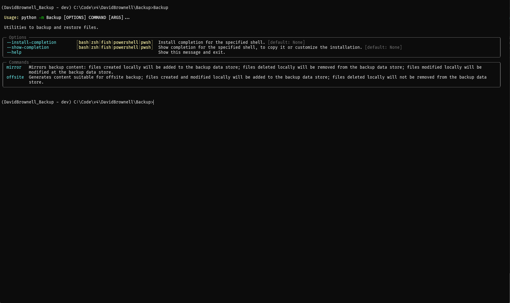
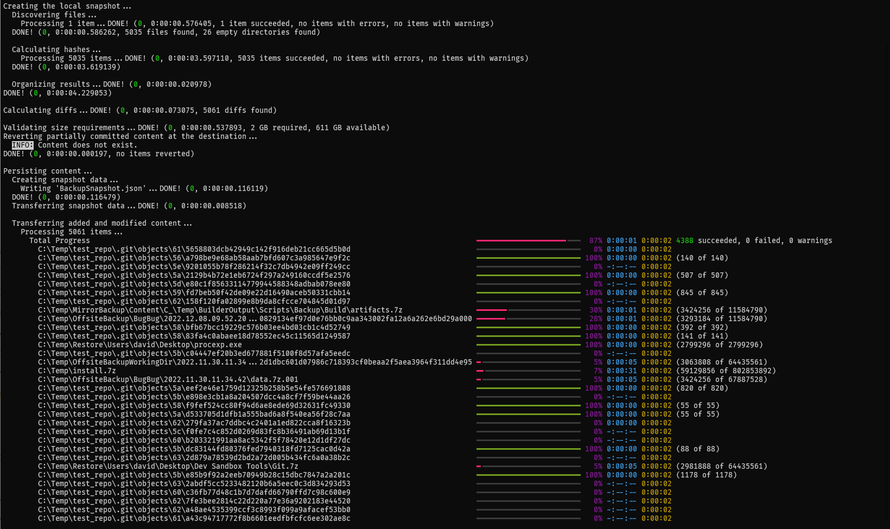
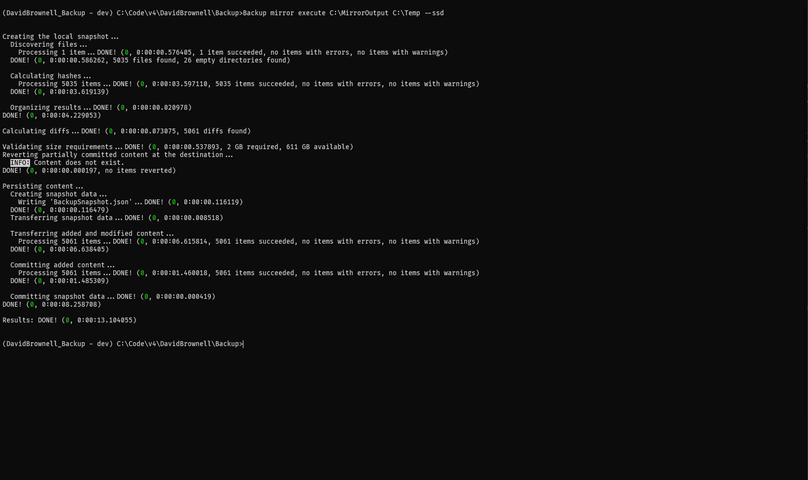

# Backup
Tools for creating and restoring backups. Backups can [mirror](#mirror) local content or create snapshots of changes suitable for [offsite](#offsite) backup.

## Screenshots

### Command Line

### In Progress

### Complete

## Glossary

<dl>

<dt>Mirror</dt>
<dd>A backup that matches the source content exactly: files added locally will be added at the destination; files modified locally will be modified at the destination; files removed locally will be removed at the destination. The destination will be an exact mirror of the source when the backup process is complete.
</dd>

<dt>Offsite</dt>
<dd>A series of backups that capture changes over time. This backup is best suited for large backups that are stored at an offsite location. During each invocation, changes from the pervious backups are calculated. Upon restoration, the changes in these backups are "replayed" in sequential order to ultimately produce the final state.
</dd>

<dt>Data Store</dt>
<dd>Backups can be stored at many locations: your local file system, in the cloud (e.g. <a href="https://aws.amazon.com/s3/storage-classes/glacier/" target=_blank>Amazon Glacier</a>), on a <a href="https://en.wikipedia.org/wiki/SFTP" target=_blank>SFTP server</a>, etc. These specific storage locations are examples of the more generate concept of a data store.

Backup functionality can be invoked using `destination strings` customized to specific data stores that best meet your backup needs.
</dd>

</dl>
